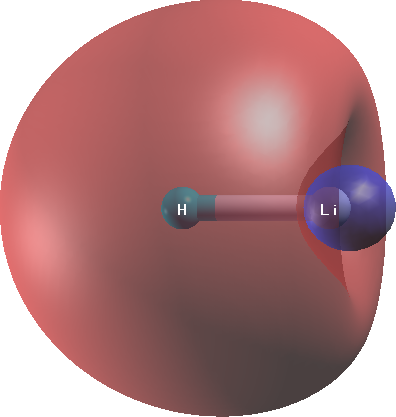
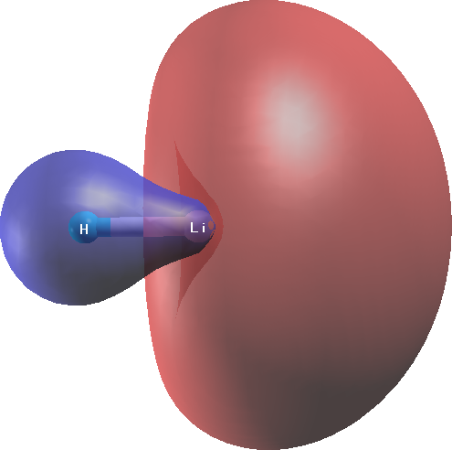

# ffr-LFDFT

NOTE: This is a work in progress.

## Introduction

`ffr-LFDFT` is an experimental package to solve [electronic structure problems](https://en.wikipedia.org/wiki/Electronic_structure)
based on [density functional theory](https://en.wikipedia.org/wiki/Density_functional_theory)
(DFT)
and [Kohn-Sham equations](https://en.wikipedia.org/wiki/Kohn%E2%80%93Sham_equations)
using Lagrange basis functions.

This package is growing from my implementation of Prof. Arias'
[practical DFT mini-course](http://jdftx.org/PracticalDFT.html).
While plane wave is used as the basis set in the course, Lagrange basis functions
is used as the basis set in this package.

Presently, it can do total energy calculations via SCF and direct minimization.
Force calculations and other types of calculatiosn are planned in the future.

## Requirements

`ffr-LFDFT` is mainly written in Fortran, so a Fortran compiler is required to build
the pakckage.
Currently it has been tested using the following compilers:
- [`gfortran`](https://gcc.gnu.org/fortran/)
- [`g95`](http://www.g95.org)
- [`ifort`](https://software.intel.com/en-us/fortran-compilers)
- [`pgf90`](https://www.pgroup.com/products/community.htm)
- [`sunf95`](http://www.oracle.com/technetwork/server-storage/developerstudio/downloads/index.html)

A C-99 compliant C compiler is also required to compile one external C source file (`Faddeeva.c`).
Recent version of `gcc` should be OK for this.

This repository includes selected `SPARSKIT` files. `SPARSKIT` is used for sparse-matrix vector
multiplication and ILU0 preconditioning. These files are written in FORTRAN77.

This repository also includes
slightly modified `bspline-fortran`.
Recent version of `gfortran` is required to compile this file.

Several numerical libraries are also required:
- BLAS and LAPACK
- FFTW3
- LibXC

## Building

To build the program you need to change to directory `src`
```
cd src
```

Copy the appropriate `make.inc` file from directory `platforms`.
For example, you want to use `gfortran`:
```
# execute this command under directory src
cp ../platforms/make.inc.gfortran make.inc
```
You can modify the file `make.inc` to suit your needs.

Finally you can build the program:
```
make           # build the library
make main      # for main executable
make postproc  # for post processing
```

Main executable is named `ffr_LFDFT_<compiler_name>.x`, for example `ffr_LFDFT_gfortran.x`

## Using the program

To use the main program, you need to prepare an input file.
The input files are very similar to [Quantum Espresso](http://www.quantum-espresso.org/)'s
`pw.x` input.
The following is an example of input file for LiH molecule:
```
&CONTROL
  pseudo_dir = '../../pseudopotentials/pade_gth'
  etot_conv_thr = 1.0d-6
/

&SYSTEM
  ibrav = 8
  nat = 2
  ntyp = 2
  A = 8.46683536902
  B = 8.46683536902
  C = 8.46683536902
  nr1 = 45
  nr2 = 45
  nr3 = 45
  Nstates_extra_ = 1
/

&ELECTRONS
  KS_Solve = 'SCF'
  cg_beta = 'PR'
  electron_maxstep = 150
  mixing_beta = 0.5
  diagonalization = 'LOBPCG'
  startingwfc = 'random'
/

ATOMIC_SPECIES
Li   3.0  Li-q3.gth
H    1.0  H-q1.gth

ATOMIC_POSITIONS angstrom
H     3.48341768451073     4.23341768451073     4.23341768451073
Li    4.98341768451073     4.23341768451073     4.23341768451073
```

To run the main program

```
ffr_LFDFT_gfortran.x INPUT > LOG
```

More examples can be found in `work` directory.

## Post-processing program

One post-processing program, with very limited capability, is also provided.
Currently it only can produce 3D orbital in XSF (Xcrysden) format.



